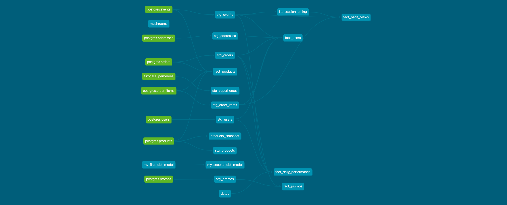

# Week 2 Project Questions

## Part 1. Models

### Question: What is our user repeat rate?

#### Answer:
Our **repeat user rate is 80%** (rounded from 0.798387). 

* That is, of our 124 total customers, 99 of those have purchased two or more times.

##### QUERY:
```sql
WITH aggregate_buyers AS (
    SELECT 
        DISTINCT user_id, 
        COUNT (DISTINCT order_id) AS count_orders
    FROM DEV_DB.DBT_KWESTERNBETTERCOLLECTIVECOM.STG_ORDERS
    GROUP BY 1),

segment_buyers AS (
    SELECT *,
        CASE
            WHEN count_orders = 1 THEN 'single_buyer'
            WHEN count_orders >= 2 THEN 'repeat_buyer'
        END AS buyer_type            
    FROM aggregate_buyers)

SELECT 
    buyer_type, 
    COUNT (DISTINCT user_id) AS count_buyers, 
    DIV0(COUNT (DISTINCT user_id), SUM(COUNT(*)) OVER()) AS pct_total_buyers
FROM segment_buyers
GROUP BY 1
```

### Question: What are good indicators of a user who will likely purchase again? What about indicators of users who are likely NOT to purchase again?

#### Answer: Potential indicators of Repeat vs. Single Purchasers

##### Orders
- Are first-time buyers with higher (or lower) `QUANTITY` values more likely to buy again? 
- Are first-time buyers with higher (or lower) `ORDER_COST` values more likely to buy again?

#### Products
- Are first-time buyers of specific products more or less likely to order again?

##### User Journey
- How many sessions did customer have before making first purchase?
- How many products did customer view before making a first purchase?
- What is length of time between first session start and first order?
- What is relationship between landing page (`URL`) of **first** session and a second order? 

##### Delivery/Shipping

- How long did it take customer to receive order, and is that correlated with lilkihood of a second purchase?
- How does raw `SHIPPING_COST` of first order impact liklihood to buy again? What about `SHIPPING_COST` as a percentage of `ORDER_TOTAL`?
- How does the `SHIPPING_SERVICE` impact liklihood to buy a second time?
- Was the `ESTIMATED_DELIVERY_AT` of first order accurate? Did order (`DELIVERED_AT`) arrive early, on-time, or late relative to estimate?

#### Users
- Are customers in specific `ZIPCODE`'s likely to buy again? Are high-repeat zipcodes related to affluence/median HHI, distance from shipping center, or other factors?
- Based on a classification of `FIRST_NAME`, are men or women more likely to repeat as a buyer?
- What is the relationship between first `EVENTS.CREATED_AT`, `USERS.CREATED_AT` and first `ORDERS.CREATED_AT` and the subsequent correlation to the second `ORDERS.CREATED_AT`? More specifically, in order to maximize repeat user rate, should our goal be to convert anonymous users to registered users

#### Promo Code

- Does use of a promo code on **first** order (non-NULL value in `ORDERS.PROMO_ID`) impact lilkihood of a second order? Do specific `PROMO_ID` values perform better for subsequent users?
- What is influence of use of a promo code on **second** order (non-NULL value in `ORDERS.PROMO_ID`)?
- If a promo code was used, how much of a `DISCOUNT` did customer receive from promo code?

### Question: Data considerations for further exploratory analysis

#### Answer:
- How does first session referral source / medium impact liklihood to buy again? To answer this, we would need referral and UTM columns added to the `EVENTS` table and dim models to classify those values into useable buckets (e.g., paid, social, search, direct, affiliate)
- How does first session device type impact liklihood to buy again?
- Did buyer engage with customer support before / after first purchase?
- Did buyer receive continued marketing campaigns/messages after first purchase?
- Did buyer rate/review product on our website after purchase?
- Did first-time buyer order for themselves or for another person?


### Question: Explain the product mart models you added.

#### Answer: I added the following models:

- `product/fact_page_views.sql`: A summation of event activity.
- `product/fact_products.sql`: A join of the products table to order and events data, including total sales, total buyers, total revenue, total pageviews, total add-to-cart events, and conversion rates, by product.
- `marketing/fact_users.sql`: A join of the users table to order and events data, including total sales, total buyers, total orders, total revenue, total web events (by event), a custom categorization of buyer type (never/first/repeat), days since last order, and calculated averages for order size details, by user.
- `marketing/fact_promos.sql`: A join the promos table to order performance, including total orders, total buyers, and total discount applied, by promo.
- `core/fact_daily_performance.sql`: A join of daily order and event performance to a custom seed table to provide a summary of site activity.

### Question: Why did you organize the models in the way you did?

#### Answer: 

- I used more `fact` tables than `dim` because the udnerlying stage tables were sufficient to provide the necessary metadata. 
- By focusing on `fact` tables I was preparing underlying tables that I thought a data analyst would frequently encounter or seek to build a visualization against.
- In particular, I thought the first questions we would want to know were how is the business performing on a daily basis, who are our most valuable users, and what are our best-performing products -- questions that can be answering with the `fact` tables I created.

#### DAG Visualization


## Part 2. Tests

### Question: What assumptions are you making about each model? (i.e. why are you adding each test?)

#### Answer:
I have tests set up against the underlying stg models to ensure uniqueness and non-null values.


### Question: Did you find any “bad” data as you added and ran tests on your models? How did you go about either cleaning the data in the dbt model or adjusting your assumptions/tests?

#### Answer:
No "bad" data was found with tests.

### Question: Your stakeholders at Greenery want to understand the state of the data each day. Explain how you would ensure these tests are passing regularly and how you would alert stakeholders about bad data getting through.

#### Answer: 
I would schedule the tests to run each morning. Alerts should be sent to an internal Slack channel to alert data team to issues with the data and allow them to resolve. If not resolved by a certain time, a wider broadcast could be sent to stakeholders to alert them to any issues. Statuses could also be conveyed on Tableau/Looker dashes to indicate data freshness and quality.

## Part 3. Snapshots

### Question: Which products had their inventory change from week 1 to week 2? 

#### Answer:

The following products had inventory increases:


```
PRODUCT_ID	INVENTORY_SNAPSHOT_W1	INVENTORY_SNAPSHOT_W2	INVENTORY_CHANGE
fb0e8be7-5ac4-4a76-a1fa-2cc4bf0b2d80	10	58	48
55c6a062-5f4a-4a8b-a8e5-05ea5e6715a3	25	51	26
4cda01b9-62e2-46c5-830f-b7f262a58fb1	20	40	20
be49171b-9f72-4fc9-bf7a-9a52e259836b	64	77	13
```

##### QUERY
```sql
WITH snapshot_1 AS (
    SELECT 
    DISTINCT product_id,
    inventory AS inv
    FROM DEV_DB.DBT_KWESTERNBETTERCOLLECTIVECOM.PRODUCTS_SNAPSHOT
    WHERE dbt_valid_to IS NULL),

snapshot_2 AS (
    SELECT 
    DISTINCT product_id,
    inventory AS inv
    FROM DEV_DB.DBT_KWESTERNBETTERCOLLECTIVECOM.PRODUCTS_SNAPSHOT
    WHERE dbt_valid_to IS NOT NULL)

SELECT 
    s1.product_id,
    s1.inv AS inventory_snapshot_w1,
    s2.inv AS inventory_snapshot_w2,
    COALESCE(s2.inv - s1.inv,0) AS inventory_change
FROM snapshot_1 AS s1
LEFT JOIN snapshot_2 AS s2
    ON s1.product_id = s2.product_id
ORDER BY 4 DESC
```