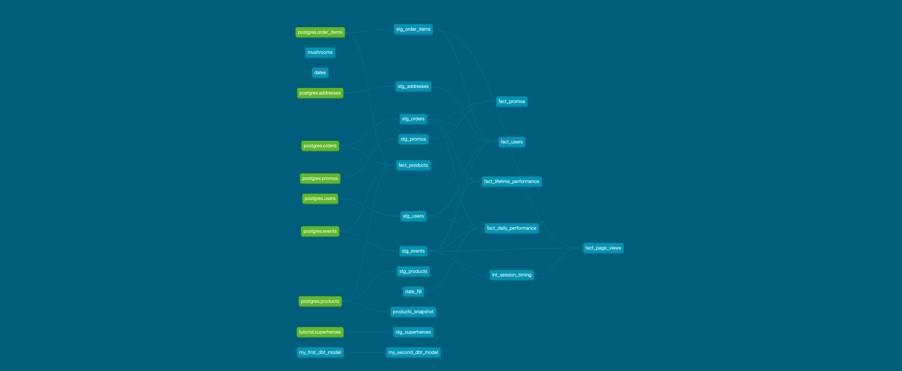

# Week 3 Project Questions

## Part 1: Create new models to answer the first two questions

> Conversion rate is defined as the # of unique sessions with a purchase event / total number of unique sessions. Conversion rate by product is defined as the # of unique sessions with a purchase event of that product / total number of unique sessions that viewed that product

### Question: What is our overall conversion rate?

### Answer: The overall conversion rate is 62% (rounded from 0.624567474)

Of the 578 unique sessions, 361 of them had a checkout/purchase event.

##### QUERY
```sql
SELECT OVERALL_CONVERSION_RATE
FROM DEV_DB.DBT_KWESTERNBETTERCOLLECTIVECOM.FACT_LIFETIME_PERFORMANCE
```


### Question: What is our conversion rate by product?

### Answer: The conversion rate by product is below. I used a `fact_products` model that I created in Week 2 that had pre-calcuated this rate.

| PRODUCT_ID                           | NAME                | SESSION_VIEW_TO_ORDER_EVENT_CONVERSION_RATE |
|--------------------------------------|---------------------|---------------------------------------------|
| fb0e8be7-5ac4-4a76-a1fa-2cc4bf0b2d80 | String of pearls    | 0.609375                                    |
| 74aeb414-e3dd-4e8a-beef-0fa45225214d | Arrow Head          | 0.5555555556                                |
| c17e63f7-0d28-4a95-8248-b01ea354840e | Cactus              | 0.5454545455                                |
| b66a7143-c18a-43bb-b5dc-06bb5d1d3160 | ZZ Plant            | 0.5396825397                                |
| 689fb64e-a4a2-45c5-b9f2-480c2155624d | Bamboo              | 0.5373134328                                |
| 579f4cd0-1f45-49d2-af55-9ab2b72c3b35 | Rubber Plant        | 0.5185185185                                |
| be49171b-9f72-4fc9-bf7a-9a52e259836b | Monstera            | 0.5102040816                                |
| b86ae24b-6f59-47e8-8adc-b17d88cbd367 | Calathea Makoyana   | 0.5094339623                                |
| e706ab70-b396-4d30-a6b2-a1ccf3625b52 | Fiddle Leaf Fig     | 0.5                                         |
| 5ceddd13-cf00-481f-9285-8340ab95d06d | Majesty Palm        | 0.4925373134                                |
| 615695d3-8ffd-4850-bcf7-944cf6d3685b | Aloe Vera           | 0.4923076923                                |
| 35550082-a52d-4301-8f06-05b30f6f3616 | Devil's Ivy         | 0.4888888889                                |
| 55c6a062-5f4a-4a8b-a8e5-05ea5e6715a3 | Philodendron        | 0.4838709677                                |
| a88a23ef-679c-4743-b151-dc7722040d8c | Jade Plant          | 0.4782608696                                |
| 5b50b820-1d0a-4231-9422-75e7f6b0cecf | Pilea Peperomioides | 0.4745762712                                |
| 64d39754-03e4-4fa0-b1ea-5f4293315f67 | Spider Plant        | 0.4745762712                                |
| 37e0062f-bd15-4c3e-b272-558a86d90598 | Dragon Tree         | 0.4677419355                                |
| d3e228db-8ca5-42ad-bb0a-2148e876cc59 | Money Tree          | 0.4642857143                                |
| c7050c3b-a898-424d-8d98-ab0aaad7bef4 | Orchid              | 0.4533333333                                |
| 05df0866-1a66-41d8-9ed7-e2bbcddd6a3d | Bird of Paradise    | 0.45                                        |
| 843b6553-dc6a-4fc4-bceb-02cd39af0168 | Ficus               | 0.4264705882                                |
| bb19d194-e1bd-4358-819e-cd1f1b401c0c | Birds Nest Fern     | 0.4230769231                                |
| 80eda933-749d-4fc6-91d5-613d29eb126f | Pink Anthurium      | 0.4189189189                                |
| e2e78dfc-f25c-4fec-a002-8e280d61a2f2 | Boston Fern         | 0.4126984127                                |
| 6f3a3072-a24d-4d11-9cef-25b0b5f8a4af | Alocasia Polly      | 0.4117647059                                |
| e5ee99b6-519f-4218-8b41-62f48f59f700 | Peace Lily          | 0.4090909091                                |
| e18f33a6-b89a-4fbc-82ad-ccba5bb261cc | Ponytail Palm       | 0.4                                         |
| e8b6528e-a830-4d03-a027-473b411c7f02 | Snake Plant         | 0.397260274                                 |
| 58b575f2-2192-4a53-9d21-df9a0c14fc25 | Angel Wings Begonia | 0.393442623                                 |
| 4cda01b9-62e2-46c5-830f-b7f262a58fb1 | Pothos              | 0.3442622951                                |


The model also includes conversion rates for other flows at the product level, including page view-to-cart and cart-to-order.


##### QUERY
```sql
SELECT product_id, name, session_view_to_order_event_conversion_rate    
FROM DEV_DB.DBT_KWESTERNBETTERCOLLECTIVECOM.FACT_PRODUCTS
ORDER BY 3 DESC
```

## Part 2: Macros

### Task: Create a macro to simplify part of a model(s). Document the macro(s) using a .yml file in the macros directory. 

> One potential macro in our data set is aggregating event types per session. Start here as your first macro and add other macros if you want to go further.

### Result: I added the "sum_of" macro to the `fact_page_views` model.

The "sum_of" source is located in macros > sum_of.sql and shown below:
```sql


SUM(CASE WHEN {{ col_name }} = '{{ col_value }}' THEN 1 ELSE 0 END)


```


I edited my `fact_page_views` model as shown below:

```sql


SELECT 
    e.session_id,
    e.user_id,
    COALESCE(e.product_id, oi.product_id) AS product_id,
    s.session_started_at,
    s.session_ended_at,
    
    {{ sum_of('e.event_type', event_type ) }} AS {{ event_type }}s,
    
    DATEDIFF('MINUTE', s.session_started_at, s.session_ended_at) AS session_length_minutes
```


I declared the "sum_of" macro in a new `macros.yml` file:

```
macros: 
  - name: sum_of
    description: Aggregation function that sums a column with a specific value
    arguments: 
      - name: col_name
        description: Target column
      - name: col_value
        description: Target value of column
```        


## Part 3: Permissions

### Task: Add a post hook to your project to apply grants to the role “reporting”. 

### Result: I edited the `dbt_project.yml` file as shown below to add a post-run hook to apply grants to the role "reporting".

```
models:
  greenery:
    +post-hook:
      - "{{ grant(role='reporting') }}"
```      

I confirmed in Snowflake query history that the hook successfully ran:

```sql
GRANT SELECT ON dev_db.dbt_kwesternbettercollectivecom.fact_page_views TO ROLE reporting;
```

## Part 4: Install a package and apply macros or tests

### Task: Install a package (i.e. dbt-utils, dbt-expectations) and apply one or more of the macros to your project.

### Result: I installed both dbt-utils and dbt-expectations. Featured application of macro is date_spine from dbt-utils.

I applied the "date_spine" macro to a model I previously created named `fact_daily_performance`. This model aggregated company performance (e.g., orders, revenue, sessions, etc.) by date. I had previously used a seed file to create table of dates that I could join the various models to. For Week 3, I replaced the reference to the seed file with the "date_spine" macro.

First, I created the date_spine sql with a new model called `date_fill`:

```sql
{{
  config(
    materialized='table'
  )
}}

{{ dbt_utils.date_spine(
    datepart="day",
    start_date="to_date('01/01/2019', 'mm/dd/yyyy')",
    end_date="to_date('01/01/2027', 'mm/dd/yyyy')"
   )
}} 
```

I then referenced this model in the target model (`fact_daily_performance`):
```sql
WITH dates AS (
    SELECT 
        date_day AS date
FROM {{ ref('date_fill') }}
),

...

FROM dates AS d
FULL JOIN agg_orders AS ao
    ON d.date = ao.created_date

...
```    

## Part 5: dbt docs and DAGs

### Task: Show (using dbt docs and the model DAGs) how you have simplified or improved a DAG using macros and/or dbt packages.

### Result:

The latest model DAGs shows how the `fact_daily_performance` is no longer using the `dates` seed file and instead referencing the table `date_fill` created by the "date_spine" macro.



## Part 6. dbt Snapshots

### Question: Which products had their inventory change from week 2 to week 3? 

### Answer: The following products had their inventory change from week 2 to week 3:

| PRODUCT_ID  | NAME  |  INVENTORY_SNAPSHOT_W2 | INVENTORY_SNAPSHOT_W3  | INVENTORY_CHANGE  |
|---|---|---|---|---|
| b66a7143-c18a-43bb-b5dc-06bb5d1d3160  | ZZ Plant  | 89 | 53 | -36 |
| 4cda01b9-62e2-46c5-830f-b7f262a58fb1  | Pothos  |  20 | 0 | -20 |
| be49171b-9f72-4fc9-bf7a-9a52e259836b  | Monstera  | 64  | 50 | -14 |
| 689fb64e-a4a2-45c5-b9f2-480c2155624d  | Bamboo  | 56 | 44 | -12 |
| fb0e8be7-5ac4-4a76-a1fa-2cc4bf0b2d80  | String of pearls | 10  | 0 | -10 |
| 55c6a062-5f4a-4a8b-a8e5-05ea5e6715a3 | Philodendron  | 25 | 15 | -10 |


##### QUERY
```sql
WITH snapshot_2 AS (
    SELECT 
    DISTINCT product_id,
    name,
    inventory AS inv
    FROM DEV_DB.DBT_KWESTERNBETTERCOLLECTIVECOM.PRODUCTS_SNAPSHOT
    WHERE dbt_valid_to IS NULL OR dbt_valid_to::date = '2024-10-22'),

snapshot_3 AS (
    SELECT 
    DISTINCT product_id,
    inventory AS inv
    FROM DEV_DB.DBT_KWESTERNBETTERCOLLECTIVECOM.PRODUCTS_SNAPSHOT
    WHERE dbt_valid_from::date = '2024-10-22')

SELECT 
    s2.product_id,
    s2.name,
    s2.inv AS inventory_snapshot_w2,
    s3.inv AS inventory_snapshot_w3,
    COALESCE(s3.inv - s2.inv,0) AS inventory_change
FROM snapshot_2 AS s2
LEFT JOIN snapshot_3 AS s3
    ON s2.product_id = s3.product_id
ORDER BY 5
```